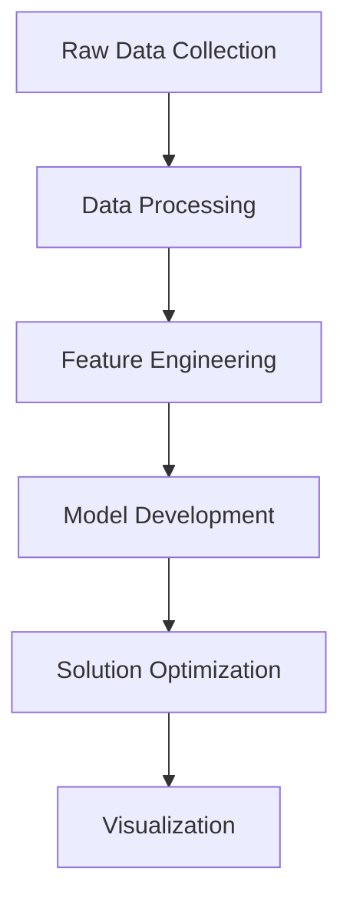

# KW EV Charging Station Optimization

An optimization model for placing electric vehicle charging stations in the Kitchener-Waterloo region.

## Table of Contents
- [KW EV Charging Station Optimization](#kw-ev-charging-station-optimization)
  - [Table of Contents](#table-of-contents)
  - [1. Project Overview](#1-project-overview)
    - [1.1. Core Features](#11-core-features)
    - [1.2. Development Journey](#12-development-journey)
  - [2. Technical Architecture](#2-technical-architecture)
    - [2.1. Directory Structure](#21-directory-structure)
    - [2.2 Data Flow](#22-data-flow)
    - [2.3 Core Components](#23-core-components)
  - [3. Project Steps](#3-project-steps)
    - [3.1. Setup and Data Collection](#31-setup-and-data-collection)
    - [3.2. Data Analysis and Processing](#32-data-analysis-and-processing)
    - [3.3. Model Development](#33-model-development)
    - [3.4. Validation and Testing](#34-validation-and-testing)
    - [3.5. Documentation and Deployment](#35-documentation-and-deployment)
  - [4. Getting Started](#4-getting-started)
    - [4.1 Installation](#41-installation)
    - [4.2. Data Exploration](#42-data-exploration)
    - [4.3. Model Development](#43-model-development)
  - [5. Results and Analysis](#5-results-and-analysis)
  - [6. Contributors](#6-contributors)
  - [7. License](#7-license)


## 1. Project Overview

This project develops an optimization model for placing electric vehicle charging stations across the Kitchener-Waterloo region. The model considers various factors including:

- Population density
- Traffic patterns
- Grid capacity
- Infrastructure costs
- Existing charging infrastructure

### 1.1. Core Features

1. **Data Integration**
   - OpenStreetMap integration for location data
   - Real-time traffic data consideration
   - Grid capacity analysis
   - Population density mapping

1. **Optimization Model**
   - Facility location optimization
   - Capacity planning
   - Cost minimization
   - Coverage maximization

### 1.2. Development Journey

Our approach evolves through several stages:
1. Data collection and preprocessing
1. Initial model development
1. Constraint refinement
1. Solution optimization

## 2. Technical Architecture

### 2.1. Directory Structure

```plaintext
kw-ev-charging-optimization/
├── data/
│   ├── raw/                      # Raw data files
│   └── processed/                # Processed datasets
├── notebooks/
│   ├── 01_data_exploration.ipynb # Data analysis
│   └── 02_model_development.ipynb# Model implementation
├── src/
│   ├── data/                     # Data processing scripts
│   ├── models/                   # Optimization models
│   └── visualization/            # Visualization utilities
├── requirements.txt
└── README.md
```

### 2.2 Data Flow



### 2.3 Core Components

1. Data Collection Pipeline

   - OpenStreetMap integration
   - Traffic data collection
   - Population density mapping


2. Optimization Model

   - Facility location formulation
   - Capacity constraints
   - Cost optimization

## 3. Project Steps

### 3.1. Setup and Data Collection
- [x] Project setup and environment configuration
- [x] Initial data collection infrastructure
- [x] Basic visualization capabilities
- [ ] Real charging station data integration
   * OpenChargeMap API integration
   * Data validation and cleaning
   * Historical data analysis

### 3.2. Data Analysis and Processing
- [ ] Population density analysis
   * Census data integration
   * Demographic clustering
   * Demand point generation
- [ ] Traffic flow integration
   * Peak hour analysis
   * Route optimization
   * Demand patterns
- [ ] Grid capacity analysis
   * Power infrastructure mapping
   * Capacity constraints
   * Upgrade possibilities

### 3.3. Model Development
- [ ] Basic facility location model
   * Cost minimization
   * Coverage maximization
   * Capacity constraints
- [ ] Enhanced constraints
   * Grid limitations
   * Traffic patterns
   * Population density
- [ ] Solution optimization
   * Parameter tuning
   * Scenario analysis
   * Sensitivity testing

### 3.4. Validation and Testing
- [ ] Model validation
   * Cross-validation
   * Scenario testing
   * Performance metrics
- [ ] Solution analysis
   * Cost-benefit analysis
   * Coverage analysis
   * Implementation feasibility

### 3.5. Documentation and Deployment
- [ ] Technical documentation
   * Model specifications
   * Data dictionary
   * API documentation
- [ ] Results visualization
   * Interactive maps
   * Performance dashboards
   * Scenario comparisons

## 4. Getting Started

### 4.1 Installation

1. Clone the Repository
    ```bash
    git clone https://github.com/jaxendutta/kw-ev-charging-optimization.git
    cd kw-ev-charging-optimization
    ```

1. Create Virtual Environment
   ```bash
   python -m venv venv
   source venv/bin/activate  # On Windows: venv\Scripts\activate
    ```

1. Install Dependencies
   ```bash
   pip install -r requirements.txt
   ```

1. Verify Setup
   ```bash
   python src/verify_setup.py
   ```

### 4.2. Data Exploration
Launch the data exploration notebook.

```bash
jupyter notebook notebooks/01_data_exploration.ipynb
```

This notebook will:

- Load existing charging station data
- Display potential location statistics
- Show interactive map visualization
- Generate initial insights

### 4.3. Model Development
Launch the model development notebook.

```bash
jupyter notebook notebooks/02_model_development.ipynb
```

This notebook will:

- Set up optimization model
- Define constraints
- Run scenarios
- Analyze results

## 5. Results and Analysis

[To be added]

## 6. Contributors
- [Jaxen Dutta](https://github.com/jaxendutta) / [a9dutta](mailto:a9dutta@uwaterloo.ca)
- Sabeer Ghura / [sghura](mailto:sghura@uwaterloo.ca)
- Kevin Ke / [q4ke](mailto:q4ke@uwaterloo.ca)
- Leslie Shen / [l72shen](mailto:l72shen@uwaterloo.ca)

## 7. License

