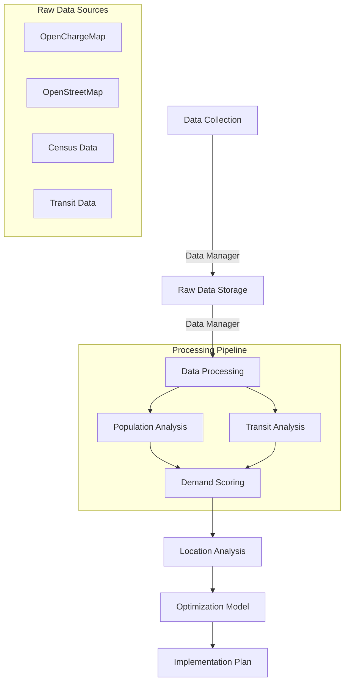

# Region of Waterloo EV Charging Station Optimization

A comprehensive  mixed-integer programming optimization model for enhancing the region's electric vehicle charging network through strategic upgrades, expansions, and reconfigurations, using real-world data and advanced spatial analysis techniques.

## Table of Contents
- [Region of Waterloo EV Charging Station Optimization](#region-of-waterloo-ev-charging-station-optimization)
  - [Table of Contents](#table-of-contents)
  - [1. Project Overview](#1-project-overview)
  - [2. Optimization Strategy](#2-optimization-strategy)
  - [3. Core Features](#3-core-features)
  - [4. Analysis Journey](#4-analysis-journey)
  - [5. Technical Architecture](#5-technical-architecture)
    - [5.1. Directory Structure](#51-directory-structure)
    - [5.2. Data Flow](#52-data-flow)
    - [5.3. Project Components](#53-project-components)
  - [6. Getting Started](#6-getting-started)
    - [6.1. Prerequisites](#61-prerequisites)
    - [6.2. Installation](#62-installation)
    - [7.3. Environment Setup](#73-environment-setup)
    - [7.4. Workflow Guide](#74-workflow-guide)
  - [8. Results and Analysis](#8-results-and-analysis)
    - [8.1 Expected Outcomes](#81-expected-outcomes)
  - [9. Contributing](#9-contributing)
  - [10. License](#10-license)

## 1. Project Overview

This project develops a comprehensive optimization model for enhancing the region's EV charging infrastructure through four key strategies:

1. Strategic L2 to L3 Conversion
   - Identification of high-impact L2 stations for L3 upgrades
   - Grid capacity consideration for upgrades
   - Cost-benefit analysis of conversions
   - Phased implementation planning

1. Network Coverage Enhancement
  - Population coverage maximization
  - EV ownership density alignment
  - Transit accessibility integration
  - Service area optimization

1. Infrastructure Optimization
  - Removal of underutilized stations
  - Strategic new station placement
  - Port count optimization at existing locations
  - Grid capacity-aware planning

1. Comprehensive Network Planning
  - Demand-driven location selection
  - Multi-objective optimization
  - Cost-effective implementation
  - Future growth consideration

The model integrates:
- Real EV ownership patterns from Ontario's FSA-level data
- Existing charging infrastructure from OpenChargeMap
- Population demographics from Statistics Canada Census 2021
- Transit network data from Grand River Transit
- Land use and accessibility metrics
- Grid capacity constraints

## 2. Optimization Strategy

Our optimization approach focuses on:

1. **L2 to L3 Conversion**
   - **Decision Variables:**
     - Binary variables for upgrade decisions
     - Port addition variables
     - Grid capacity allocation
   - **Constraints:**
     - Maximum power capacity per area
     - Minimum distance between L3 chargers
     - Budget limitations
     - Implementation timing

2. **Coverage Maximization**
   - **Objectives:**
     - Population coverage within 5km of L3
     - EV density-weighted coverage
     - Transit accessibility integration
   - **Constraints:**
     - Minimum coverage requirements
     - Maximum service overlap
     - Equity considerations

3. **Station Optimization**
   - **Removal Criteria:**
     - Usage patterns
     - Coverage redundancy
     - Operating costs
     - Alternative availability
   - **New Placement:**
     - Demand-driven locations
     - Grid capacity availability
     - Cost-effectiveness
     - Future growth potential

4. **Port Addition Strategy**
   - **Decision Factors:**
     - Peak usage patterns
     - Wait time data
     - Population growth
     - EV adoption trends

Key Mathematical Components:
  ```python
  # Decision Variables
  x[i,j] = Binary variable for upgrading station i to type j
  y[i] = Binary variable for adding new station at location i
  z[i] = Binary variable for removing station i
  p[i] = Integer variable for additional ports at location i

  # Objective Function
  Maximize:
      Coverage_Score         # Population and EV coverage
      - Installation_Costs   # Upgrade and new station costs
      - Operating_Costs      # Ongoing operational costs
      + Efficiency_Score     # Network efficiency metrics

  Subject to:
      - Budget constraints
      - Grid capacity at each location
      - Minimum coverage requirements
      - Maximum distance between L3 chargers
      - Demand satisfaction constraints
      - Maximum stations per area
  ```

## 3. Core Features

1. **Data Integration & Analysis**
   - EV ownership density analysis
   - Population density mapping
   - Transit accessibility scoring
   - Land use pattern analysis
   - Grid capacity assessment


1. **Network Enhancement Strategy**
   - Level 2 to Level 3 conversion optimization
   - Strategic port addition planning
   - Coverage gap identification
   - Grid capacity consideration
   - Cost-benefit analysis

1. **Optimization Framework**
  - Mixed-integer linear programming model
  - Multi-objective optimization:
    - Coverage maximization
    - Cost minimization
    - Grid capacity constraints
    - Level 3 spacing requirements
  - Implementation phasing
  - Sensitivity analysis

1. **Visualization & Analysis**
  - Interactive coverage maps
  - EV density heatmaps
  - Accessibility scoring
  - Network analysis metrics
  - Implementation recommendations

## 4. Analysis Journey

Our approach follows a systematic, data-driven methodology:

1. **Data Integration**
   - Collect and clean data
   - Validate geographic coverage
   - Process EV ownership patterns
   - Calculate baseline metrics

1. **Network Analysis**
   - Assess current coverage
   - Identify upgrade candidates
   - Calculate accessibility scores
   - Evaluate grid capacity

1. **Optimization**
   - Define objective functions
   - Set up constraints
   - Generate solutions
   - Analyze sensitivity

1. **Implementation Planning**
   - Prioritize upgrades
   - Phase implementations
   - Consider grid constraints
   - Estimate costs

## 5. Technical Architecture

### 5.1. Directory Structure

```plaintext
kw-ev-charging-optimization/
├── data/
│   ├── raw/
|   |   ├── boundaries/
│   │   ├── charging_stations/
│   │   ├── ev_fsa/
│   │   ├── population/
│   │   └── potential_locations/
|   | 
│   └── processed/
|       ├── demand_points/
|       ├── ev_fsa_analyzed/
│       ├── integrated_analyzed_data/
│       └── optimization_inputs/
|
├── notebooks/
│   ├── 01_data_collection.ipynb      # Data integration
│   ├── 02_location_analysis.ipynb    # Spatial analysis
│   ├── 03_enhancement_analysis.ipynb # Network enhancement
│   ├── 04_data_preparation.ipynb     # Model input prep
│   └── 05_optimization_model.ipynb   # MILP optimization
├── src/
│   ├── data/
│   │   ├── constants.py          # Project constants
│   │   ├── data_manager.py       # Data processing
│   │   └── utils.py             # Helper functions
|   |
│   ├── model/
│   │   └── network_optimizer.py  # Optimization model
|   |
│   ├── visualization/
|   |   ├── map_viz.py
│   |   └── optimization_viz.py
|   |
|   ├── run_optimization.py
|   └── verify_setup.py
|
├── setup.py      
└── requirements.txt
```

### 5.2. Data Flow



### 5.3. Project Components

1. **Data Collection & Processing (`01_data_collection.ipynb`)**
   - Integration of multiple data sources
   - Data cleaning and validation
   - Geographic data processing
   - Initial visualization

2. **Location Analysis (`02_location_analysis.ipynb`)**
   - Population distribution analysis
   - Transit accessibility scoring
   - Demographic pattern identification
   - Coverage analysis

3. **Enhancement Analysis (`03_enhancement_analysis.ipynb`)**
   - EV ownership pattern analysis
   - Charging station assessment
   - Upgrade candidate identification
   - Grid capacity evaluation

4. **Data Preparation (`04_data_preparation.ipynb`)**
   - Optimization input preparation
   - Constraint calculation
   - Parameter estimation
   - Data structuring

5. **Optimization Model (`05_optimization_model.ipynb`)**
   - MILP model implementation
   - Constraint definition
   - Solution generation
   - Sensitivity analysis

## 6. Getting Started

### 6.1. Prerequisites
- Python 3.12 or higher
- Gurobi Optimizer License
- OpenChargeMap API key
- Git
- Virtual environment management tool

### 6.2. Installation

1. Clone the Repository
  ```bash
  git clone https://github.com/jaxendutta/kw-ev-charging-optimization.git
  cd kw-ev-charging-optimization
  ```

2. Create Virtual Environment
  ```bash
  python -m venv venv

  # Linux
  source venv/bin/activate

  # On Windows: venv\Scripts\activate
  ```

3. Install Project Package
  ```bash
  # Install in editable mode with development dependencies
  pip install -e .
  ```

4. Configure Environment Variables
  ```bash
  cp .env.example .env
  # Edit .env with your API keys and configuration
  ```

### 7.3. Environment Setup

1. Install Required Python Packages
   ```bash
   # Install core requirements
   pip install -r requirements.txt
   ```

1. Configure API Access
   - Obtain OpenChargeMap API key [here](https://openchargemap.org/site/developerinfo)
   - Set up environment variables in `.env` file:
     ```
     OCMAP_API_KEY=your_api_key_here
     ```

1. Verify Setup
   ```bash
   python src/verify_setup.py
   ```

### 7.4. Workflow Guide

1. Data Collection:
  ```bash
  jupyter notebook notebooks/01_data_collection.ipynb
  ```

1. Analysis Pipeline:
  ```bash
  # Run notebooks in sequence
  jupyter notebook notebooks/02_location_analysis.ipynb
  jupyter notebook notebooks/03_enhancement_analysis.ipynb
  jupyter notebook notebooks/04_data_preparation.ipynb
  jupyter notebook notebooks/05_optimization_model.ipynb
  ```

## 8. Results and Analysis

### 8.1 Expected Outcomes

1. **Network Enhancement**
   - Optimized L3 charger distribution
   - Improved coverage efficiency
   - Reduced redundancy
   - Future-proof capacity

1. **Operational Efficiency**
   - Better resource utilization
   - Reduced operating costs
   - Improved user experience
   - Sustainable growth plan

1. **Coverage Improvement**
   - Increased population coverage
   - Better alignment with EV density
   - Enhanced accessibility
   - Equitable distribution


## 9. Contributing

Please see [CONTRIBUTING.md](CONTRIBUTING.md) for detailed contribution guidelines.

## 10. License

This project is licensed under the MIT License - see the [LICENSE](LICENSE) file for details.
