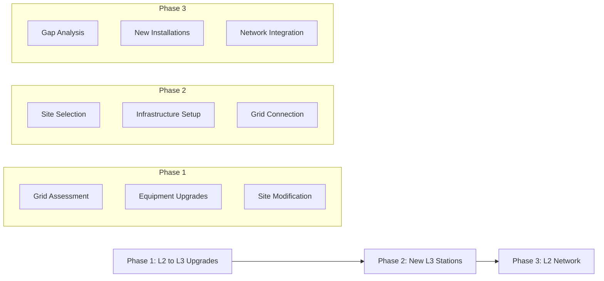

# Optimization of EV Charging Station Network in the Kitchener-Waterloo-Cambridge Region

A comprehensive mixed-integer linear programming (MILP) optimization model for strategic enhancement of the Kitchener-Waterloo Census Metropolitan Area (KWC-CMA) electric vehicle charging network. This project combines real-world data sources, advanced spatial analysis, and multi-objective optimization to recommend optimal charging infrastructure placement and upgrades.

## Table of Contents
- [Optimization of EV Charging Station Network in the Kitchener-Waterloo-Cambridge Region](#optimization-of-ev-charging-station-network-in-the-kitchener-waterloo-cambridge-region)
  - [Table of Contents](#table-of-contents)
  - [1. Project Overview](#1-project-overview)
    - [1.1. Geographic Scope](#11-geographic-scope)
    - [1.2. Core Strategies](#12-core-strategies)
  - [2. Methodology and Data Pipeline](#2-methodology-and-data-pipeline)
    - [2.1. Data Collection and Integration](#21-data-collection-and-integration)
      - [2.1.1. Geographic \& Infrastructure Data](#211-geographic--infrastructure-data)
      - [2.1.2. Population and EV Data](#212-population-and-ev-data)
      - [2.1.3. Transit Network Data](#213-transit-network-data)
    - [2.2. Analysis Pipeline](#22-analysis-pipeline)
      - [2.2.1. Location Analysis (`02_location_analysis.ipynb`)](#221-location-analysis-02_location_analysisipynb)
      - [2.2.2. Enhancement Analysis (`03_enhancement_analysis.ipynb`)](#222-enhancement-analysis-03_enhancement_analysisipynb)
      - [2.2.3. Data Preparation (`04_data_preparation.ipynb`)](#223-data-preparation-04_data_preparationipynb)
    - [2.3. Demand Point Generation](#23-demand-point-generation)
      - [2.3.1. Population-Based Points: Base Generation](#231-population-based-points-base-generation)
      - [2.3.2. EV Integration: FSA Data Processing](#232-ev-integration-fsa-data-processing)
      - [2.3.3. Scoring Components:](#233-scoring-components)
  - [3. Technical Implementation](#3-technical-implementation)
    - [3.1. Optimization Model Architecture](#31-optimization-model-architecture)
      - [3.1.1. Core Components](#311-core-components)
      - [3.1.2. Decision Framework](#312-decision-framework)
      - [3.1.3. Constraint Structure](#313-constraint-structure)
    - [3.2. Data Processing Pipeline](#32-data-processing-pipeline)
      - [3.2.1. Raw Data Processing](#321-raw-data-processing)
      - [3.2.2. Analysis Workflow](#322-analysis-workflow)
      - [3.2.3. Optimization Preparation](#323-optimization-preparation)
    - [3.3. Optimization Implementation](#33-optimization-implementation)
      - [3.3.1. Model Configuration (`network_optimizer.py`)](#331-model-configuration-network_optimizerpy)
      - [3.3.2. Solution Process](#332-solution-process)
    - [3.4. Results Processing and Analysis](#34-results-processing-and-analysis)
      - [3.4.1. Coverage Analysis (`05_optimization_model.ipynb`)](#341-coverage-analysis-05_optimization_modelipynb)
      - [3.4.2. Financial Analysis](#342-financial-analysis)
    - [3.5. Implementation Planning](#35-implementation-planning)
      - [3.5.1. Phased Deployment](#351-phased-deployment)
      - [3.5.2. Technical Requirements](#352-technical-requirements)
    - [3.6. Visualization and Reporting](#36-visualization-and-reporting)
      - [3.6.1. Interactive Maps (`map_viz.py`)](#361-interactive-maps-map_vizpy)
      - [3.6.2. Results Dashboard](#362-results-dashboard)
  - [4. Getting Started](#4-getting-started)
    - [4.1. Environment Setup](#41-environment-setup)
      - [4.1.1 Prerequisites](#411-prerequisites)
      - [4.1.2. Core Dependencies](#412-core-dependencies)
- [Core Data Processing](#core-data-processing)
- [Geospatial Analysis](#geospatial-analysis)
- [Optimization](#optimization)
- [Visualization](#visualization)
- [API \& Network](#api--network)
- [Progress \& Formatting](#progress--formatting)
    - [4.2. Installation](#42-installation)
      - [4.2.1. Base Setup](#421-base-setup)
      - [4.2.2. API Configuration](#422-api-configuration)
    - [4.3. Data Pipeline Execution](#43-data-pipeline-execution)
      - [4.3.1. Data Collection](#431-data-collection)
      - [4.3.2. Analysis Pipeline](#432-analysis-pipeline)
    - [4.4. Model Configuration](#44-model-configuration)
      - [4.4.1. Basic Configuration](#441-basic-configuration)
      - [4.4.2. Scenario Configuration](#442-scenario-configuration)
    - [4.5. Running the Optimization](#45-running-the-optimization)
      - [4.5.1. Command Line Interface](#451-command-line-interface)
      - [4.5.2 Output Structure](#452-output-structure)
      - [4.5.3. Notebook Interface](#453-notebook-interface)
    - [4.6. Results Analysis](#46-results-analysis)
      - [4.6.1. Solution Visualization](#461-solution-visualization)
      - [4.6.2. Performance Metrics](#462-performance-metrics)
  - [5. Project Structure \& Standards](#5-project-structure--standards)
    - [5.1. Directory Structure](#51-directory-structure)
    - [5.2. Code Standards](#52-code-standards)
      - [5.2.1. Style Guidelines](#521-style-guidelines)
      - [5.2.2. Documentation Standards](#522-documentation-standards)
    - [5.3. Troubleshooting Guide](#53-troubleshooting-guide)
      - [5.3.1. Common Issues](#531-common-issues)
      - [5.3.2. Performance Optimization](#532-performance-optimization)
    - [5.4. Maintenance \& Updates](#54-maintenance--updates)
      - [5.4.1. Data Updates](#541-data-updates)
      - [5.4.2. Model Updates](#542-model-updates)
      - [5.4.3. Documentation Updates](#543-documentation-updates)
  - [6. Contributing](#6-contributing)
  - [7. License](#7-license)
  - [8. Sources and Citations](#8-sources-and-citations)
    - [8.1. Data Collection](#81-data-collection)
    - [8.2. Cost Parameter Estimation](#82-cost-parameter-estimation)
    - [8.3. Grid Capacity](#83-grid-capacity)
  - [9. Appendix: Mathematical Model Formulation](#9-appendix-mathematical-model-formulation)
    - [9.1. Model Definition](#91-model-definition)
    - [9.2. Decision Variables](#92-decision-variables)
    - [9.3. Parameters](#93-parameters)
      - [1. Coverage Parameters](#1-coverage-parameters)
      - [2. Cost Parameters](#2-cost-parameters)
      - [3. Infrastructure Parameters](#3-infrastructure-parameters)
    - [9.4. Constraints](#94-constraints)
      - [1. Coverage Constraints](#1-coverage-constraints)
      - [2. Budget Constraints](#2-budget-constraints)
      - [3. Grid Capacity Constraints](#3-grid-capacity-constraints)
      - [4. Logical Constraints](#4-logical-constraints)
      - [5. Service Area Constraints](#5-service-area-constraints)
      - [6. Non-Negativity and Integrality](#6-non-negativity-and-integrality)
    - [9.5. Objective Function](#95-objective-function)

## 1. Project Overview

This project develops an optimization model for enhancing the Kitchener-Waterloo-Cambridge Census Metropolitan Area's (KWC-CMA) EV charging infrastructure through comprehensive data analysis and mathematical optimization. The model addresses current infrastructure gaps while planning for future EV adoption trends.

### 1.1. Geographic Scope
The project covers the entire KWC-CMA region including:
- Major Cities: Kitchener, Waterloo, Cambridge
- Townships: Woolwich, Wilmot, North Dumfries, Wellesley
- Total Area: 1,092.33 km²
- Population: 622,370 (Region of Waterloo Data)
- Key Features: Dense urban cores, suburban areas, rural communities

### 1.2. Core Strategies

1. **Strategic L2 to L3 Conversion**
   - Identification of high-impact L2 stations for L3 upgrades based on:
     - Current utilization patterns
     - Grid infrastructure capacity
     - Population density and EV ownership
     - Implementation feasibility
   - Cost-benefit analysis incorporating:
     - Installation costs
     - Grid upgrade requirements
     - Expected usage patterns
     - Revenue potential

2. **Network Coverage Enhancement**
   - Population coverage maximization through:
     - Demographic-weighted demand analysis
     - EV ownership pattern integration
     - Multi-modal transit accessibility
     - Future growth consideration
   - Service area optimization considering:
     - Walking distance for urban areas
     - Driving distance for L3 chargers
     - Transit hub integration
     - Grid capacity constraints

3. **Infrastructure Optimization**
   - Data-driven port allocation:
     - Usage pattern analysis
     - Peak demand consideration
     - Grid capacity limits
     - Expansion potential
   - Location selection based on:
     - Population density
     - EV ownership patterns
     - Transit accessibility
     - Grid infrastructure

4. **Comprehensive Network Planning**
   - Multi-objective optimization balancing:
     - Coverage maximization
     - Cost minimization
     - Grid capacity constraints
     - Implementation feasibility
   - Phased implementation strategy:
     - Priority upgrades
     - Coverage gap filling
     - Future expansion preparation

## 2. Methodology and Data Pipeline

```mermaid
graph TD
    A[Data Collection] -->│data_manager.py│ B[Raw Data Storage]
    B --> C[Data Processing]
    
    subgraph "Primary Data Sources"
        D1[OpenChargeMap API]
        D2[Region of Waterloo OpenData]
        D3[Statistics Canada Census 2021]
        D4[Ontario EV Database]
        D5[OpenStreetMap]
    end
    
    D1 --> A
    D2 --> A
    D3 --> A
    D4 --> A
    D5 --> A
    
    subgraph "Processing Pipeline"
        C --> E[Population Analysis]
        C --> F[Transit Analysis]
        C --> G[EV Ownership Pattern Analysis]
        C --> H[Infrastructure Assessment]
        
        E --> I[Demand Point Generation]
        F --> I
        G --> I
        H --> I
    end
    
    I --> J[Optimization Model]
    J --> K[Sensitivity Analysis]
    J --> L[Implementation Plan]
```

### 2.1. Data Collection and Integration
The project follows a systematic data collection approach implemented in `data_manager.py`:

#### 2.1.1. Geographic & Infrastructure Data
- **Boundary Data**: 
  - Source: [Region of Waterloo Open Data](https://rowopendata-rmw.opendata.arcgis.com)
  - Process: UTM Zone 17N projection for accurate measurements
  - Validation: Geometric integrity checks, coordinate system verification

- **Charging Infrastructure**:
  - Source: [OpenChargeMap API](https://openchargemap.org)
  - Current Network: 183 stations (169 Level 2, 18 Level 2)
  - Details: Port configurations, operator data, power specifications
  - Processing: Grid capacity analysis, geocoding validation

- **Potential Locations**:
  - Source: [OpenStreetMap](https://www.openstreetmap.org) via [OSMnx](https://osmnx.readthedocs.io)
  - Categories: Commercial centers, parking facilities, public venues
  - Analysis: Land use compatibility, grid proximity, site suitability
  - Scoring: Multi-factor location scoring implemented in `02_location_analysis.ipynb`

#### 2.1.2. Population and EV Data
- **Census Data (2021)**:
  - Sources: [Statistics Canada](https://www12.statcan.gc.ca/census-recensement/2021/dp-pd/prof/details/page.cfm?DGUIDlist=2021S0503541), [Region of Waterloo Open Data](https://rowopendata-rmw.opendata.arcgis.com)
  - Level: Census tract granularity
  - Metrics: Population density, housing characteristics, demographic factors
  - Integration: UTM projection alignment, spatial joins

- **EV Ownership Patterns**:
  - Source: [Ontario FSA-level EV database](https://data.ontario.ca/dataset/electric-vehicles-in-ontario-by-forward-sortation-area)
  - Coverage: All KWC-CMA FSA codes
  - Processing: 
    - Density calculations per FSA
    - BEV/PHEV ratio analysis
    - Spatial distribution mapping
    - Growth trend projections

#### 2.1.3. Transit Network Data
- **Source**: [Grand River Transit Open Data](https://www.grt.ca/en/about-grt/open-data.aspx)
- **Components**:
  - GRT Bus routes and stops
  - ION LRT infrastructure
  - Service frequency data
  - Coverage area analysis
- **Integration**: Multi-modal accessibility scoring

### 2.2. Analysis Pipeline
Our analysis workflow, implemented across multiple notebooks, processes raw data into optimization inputs:

#### 2.2.1. Location Analysis (`02_location_analysis.ipynb`)
- Population distribution analysis
- Transit accessibility scoring
- Demographic pattern identification
- Service area calculations

#### 2.2.2. Enhancement Analysis (`03_enhancement_analysis.ipynb`)
- Current infrastructure assessment
- Upgrade opportunity identification
- Grid capacity evaluation
- Cost-benefit calculations

#### 2.2.3. Data Preparation (`04_data_preparation.ipynb`)
- Demand point generation
- Constraint parameter calculation
- Distance matrix computation
- Site suitability scoring

### 2.3. Demand Point Generation
The project creates sophisticated demand points to represent charging needs through a multi-factor analysis.

```mermaid
graph LR
    A[Census Tracts] -->│Population Weighting│ B[Base Points]
    C[Transit Data] -->│Accessibility Score│ D[Transit Factor]
    E[EV Ownership] -->│Density Analysis│ F[EV Factor]
    G[Infrastructure] -->│Quality Assessment│ H[Infrastructure Factor]
    
    B --> I[Demand Points]
    D --> I
    F --> I
    H --> I
    
    I -->│Score Calculation│ J[Final Weighted Points]
  ```

#### 2.3.1. Population-Based Points: Base Generation
  - Census tract centroids as initial points
  - Population-weighted adjustments
  - Density-based clustering
  - Service area calculations

#### 2.3.2. EV Integration: FSA Data Processing
  - Data from 14 FSA regions in KWC-CMA
  - Downscaling to census tract level
  - BEV/PHEV ratio consideration
  - Growth trend incorporation

#### 2.3.3. Scoring Components: 
  - EV Ownership Data (35%)
  - Infrastructure quality (25%)
  - Base population density (20%)
  - Transit accessibility (15%)
  - Infrastructure Age (5%)

## 3. Technical Implementation

### 3.1. Optimization Model Architecture

#### 3.1.1. Core Components
- **Model Type**: Multi-Objective Mixed-Integer Linear Programming (MILP)
- **Solver**: Gurobi Optimizer (Academic WLS License)
- **Implementation**: `network_optimizer.py`
- **Key Features**:
  - Multi-objective optimization
  - Budget-aware planning
  - Grid capacity constraints
  - Coverage requirements

#### 3.1.2. Decision Framework
- **Station Decisions**:
  - New L2/L3 station placement
  - L2 to L3 conversions
  - Station removal options
  - Port count optimization

- **Coverage Analysis**:
  - Population coverage tracking
  - EV owner accessibility
  - Service level guarantees
  - Future growth accommodation

#### 3.1.3. Constraint Structure
- **Infrastructure Limits**:
  - Grid capacity per location
  - Maximum stations per area
  - Minimum distance requirements
  - Port allocation rules

- **Coverage Requirements**:
  - Minimum population coverage
  - EV owner accessibility
  - Transit integration targets
  - Service redundancy

### 3.2. Data Processing Pipeline

#### 3.2.1. Raw Data Processing
- **Data Manager (`data_manager.py`)**:
  - API integrations (OpenChargeMap, Census)
  - Spatial data processing
  - Caching mechanisms
  - Error handling

- **Preprocessing Steps**:
  - Coordinate validation
  - Missing data handling
  - Projection standardization
  - Spatial indexing

#### 3.2.2. Analysis Workflow
- **Location Analysis**:
  - Population density mapping
  - Transit accessibility scoring
  - Land use compatibility
  - Grid capacity assessment

- **Enhancement Analysis**:
  - Current coverage evaluation
  - Upgrade opportunity identification
  - Cost-benefit calculations
  - Implementation feasibility

#### 3.2.3. Optimization Preparation
- **Input Generation**:
  - Demand point creation
  - Distance matrix computation
  - Constraint parameter calculation
  - Cost modeling

- **Solution Analysis**:
  - Coverage metrics
  - Financial impact
  - Implementation phasing
  - Sensitivity testing

### 3.3. Optimization Implementation

```mermaid
graph TD
    A[Input Data] --> B[Problem Setup]
    B --> C[Initial Solution]
    
    subgraph "Optimization Loop"
        C --> D[Coverage Check]
        D --> E[Cost Analysis]
        E --> F[Grid Constraints]
        F --> G[Solution Update]
        G --> D
    end
    
    G -->│Convergence│ H[Final Solution]
    H --> I[Implementation Planning]
    H --> J[Sensitivity Analysis]
```

#### 3.3.1. Model Configuration (`network_optimizer.py`)
- **Decision Variables**:
  - Binary variables for station decisions
  - Integer variables for port allocation
  - Coverage tracking variables
  - Cost accounting variables

- **Model Parameters**:
  - Grid capacity thresholds
  - Coverage radius requirements
  - Budget constraints
  - Minimum port requirements

#### 3.3.2. Solution Process
- **Setup Phase**:
  - Data structure preparation
  - Variable initialization
  - Constraint generation
  - Objective function formulation

- **Solution Strategy**:
  - Multi-phase optimization
  - Iterative refinement
  - Feasibility checking
  - Solution validation

### 3.4. Results Processing and Analysis

#### 3.4.1. Coverage Analysis (`05_optimization_model.ipynb`)
- **Geographic Coverage**:
  - Population accessibility metrics
  - EV owner coverage calculations
  - Transit integration assessment
  - Service gap identification

- **Infrastructure Distribution**:
  - Charger type analysis
  - Port allocation efficiency
  - Grid capacity utilization
  - Service redundancy evaluation

#### 3.4.2. Financial Analysis
- **Cost Breakdown**:
  - Installation expenses
  - Infrastructure upgrades
  - Grid capacity enhancements
  - Operating cost projections

- **ROI Calculations**:
  - Coverage improvement metrics
  - Cost per capita served
  - Efficiency improvements
  - Long-term value assessment

### 3.5. Implementation Planning



#### 3.5.1. Phased Deployment
- **Phase 1: Strategic Upgrades**
  - Timeframe: Months 1-4
  - Focus: L2 to L3 conversions
  - Activities: 
    - Grid capacity upgrades
    - Equipment installation
    - Site preparation

- **Phase 2: Network Expansion**
  - Timeframe: Months 5-8
  - Focus: New L3 installations
  - Activities:
    - Site development
    - Infrastructure setup
    - Grid connections

- **Phase 3: Coverage Enhancement**
  - Timeframe: Months 9-12
  - Focus: L2 network completion
  - Activities:
    - Gap filling
    - Accessibility improvements
    - Network optimization

#### 3.5.2. Technical Requirements
- **Grid Infrastructure**:
  - Power capacity analysis
  - Transformer requirements
  - Protection systems
  - Monitoring equipment

- **Site Preparation**:
  - Surface modifications
  - Accessibility improvements
  - Signage and markings
  - Safety features

### 3.6. Visualization and Reporting

#### 3.6.1. Interactive Maps (`map_viz.py`)
- **Coverage Visualization**:
  - Population density heatmaps
  - Service area overlays
  - Station status indicators
  - Implementation phase mapping

- **Analysis Layers**:
  - EV ownership density
  - Transit accessibility
  - Grid capacity zones
  - Upgrade priorities

#### 3.6.2. Results Dashboard
- **Performance Metrics**:
  - Coverage improvements
  - Cost efficiency
  - Implementation progress
  - Service level achievements

- **Analysis Views**:
  - Geographic distribution
  - Financial analysis
  - Timeline tracking
  - Impact assessment

## 4. Getting Started

### 4.1. Environment Setup

#### 4.1.1 Prerequisites
- Python 3.12.7 or higher
- Gurobi Optimizer License
- OpenChargeMap API key

#### 4.1.2. Core Dependencies

# Core Data Processing
- numpy
- pandas
- scipy

# Geospatial Analysis
- geopandas
- pyproj
- shapely
- osmnx
- haversine

# Optimization
- gurobipy

# Visualization
- matplotlib
- folium
- branca

# API & Network
- requests
- ratelimit
- python-dotenv

# Progress & Formatting
- tqdm
- tabulate

### 4.2. Installation

#### 4.2.1. Base Setup

1. Clone repository
    ```bash
    git clone https://github.com/username/kw-ev-charging-optimization.git
    cd kw-ev-charging-optimization
    ```

2. Create virtual environment
    ```
    python -m venv venv
    source venv/bin/activate  # Linux/MacOS
    # or
    venv\Scripts\activate     # Windows
    ```

3. Install Project Package
    ```bash
    # Install in editable mode with development dependencies
    pip install -e .
    ```

4. Install dependencies
    ```
    pip install -r requirements.txt
    ```

#### 4.2.2. API Configuration
1. Configure API Access
   - Obtain OpenChargeMap API key [here](https://openchargemap.org/site/developerinfo)
   - Acquire Ontario Data Portal access
   - Set up your API keys as environment variables in `.env` file in the project root with following content:
     ```
     OCMAP_API_KEY=<your_api_key_here>
     ```

2. Configure environment:
   ```bash
   cp .env.example .env
   # Edit .env with your API keys
   ```

3. Verify Setup:
    ```bash
    python src/verify_setup.py  
    # Verify final environment setup
    ```

### 4.3. Data Pipeline Execution

#### 4.3.1. Data Collection
```bash
jupyter notebook notebooks/01_data_collection.ipynb
```

#### 4.3.2. Analysis Pipeline
```bash
# Execute notebooks in order:
jupyter notebook notebooks/02_location_analysis.ipynb
jupyter notebook notebooks/03_enhancement_analysis.ipynb
jupyter notebook notebooks/04_data_preparation.ipynb
```

### 4.4. Model Configuration

#### 4.4.1. Basic Configuration
- Located in `configs/base.json`
- Key parameters:
  - Cost factors
  - Coverage requirements
  - Grid constraints
  - Implementation phases

#### 4.4.2. Scenario Configuration
- Located in `configs/scenarios/`
- Available scenarios:
  - `aggressive.json`
  - `balanced.json`
  - `conservative.json`

### 4.5. Running the Optimization

#### 4.5.1. Command Line Interface
```bash
# Basic run with default configuration
python src/run_optimization.py

# Run with specific scenario
python src/run_optimization.py --scenario balanced

# Run with custom output directory
python src/run_optimization.py --output custom_results
```

#### 4.5.2 Output Structure
```
results/
  └── results_YYYYMMDD_HHMMSS/
      ├── config.json
      │
      ├── implementation_plan.json
      ├── implementation_plan.png
      ├── implementation_plan.txt
      │
      ├── optimization.log
      │
      ├── program.json
      ├── program.txt
      │
      ├── sensitivity_analysis.json
      ├── sensitivity_analysis.png
      ├── sensitivity_analysis.txt
      │
      ├── solution.json
      ├── solution.png
      ├── solution.txt
      └── solution_map.html
```

#### 4.5.3. Notebook Interface
The optimization can also be executed using a Jupyter Notebook. This method emphasizes immediate visualization of results and does not include predefined cells for saving outputs. However, you can add cells to save your results as needed.
```bash
jupyter notebook notebooks/05_optimization_model.ipynb
```

### 4.6. Results Analysis

#### 4.6.1. Solution Visualization
- Interactive maps showing:
  - Current coverage
  - Proposed changes
  - Implementation phases
  - Service areas

#### 4.6.2. Performance Metrics
- Coverage improvement
- Cost efficiency
- Implementation timeline
- Technical feasibility

## 5. Project Structure & Standards

### 5.1. Directory Structure
```plaintext
ROOT/
├── data/                             # Data storage
│   ├── raw/                          # Raw data files
│   │   ├── boundaries/               # Geographic boundaries
│   │   ├── charging_stations/        # Station data
│   │   ├── ev_fsa/                   # EV ownership data
│   │   ├── population/               # Census data
│   │   └── potential_locations/      # Candidate sites
│   │
│   └── processed/                    # Processed datasets
│       ├── demand_points/            # Generated demand points
│       ├── ev_fsa_analyzed/          # Analyzed EV data
│       ├── integrated_analyzed_data/ # Combined analysis
│       └── optimization_inputs/      # Model inputs
│
├── notebooks/                        # Analysis notebooks
│   ├── 01_data_collection.ipynb
│   ├── 02_location_analysis.ipynb
│   ├── 03_enhancement_analysis.ipynb
│   ├── 04_data_preparation.ipynb
│   └── 05_optimization_model.ipynb
│
├── src/                              # Source code
│   ├── run_optimization.py           # Run model on the terminal
│   ├── verify_setup.py               # Verify environment setup
│   │
│   ├── data/                         # Data processing
│   │   ├── constants.py              # Project constants
│   │   ├── data_manager.py           # Data handling
│   │   └── utils.py                  # Utility functions
│   │
│   ├── model/                        # Optimization model
│   │   ├── network_optimizer.py      # Core optimizer
│   │   └── utils.py                  # Model utilities
│   │
│   └── visualization/                # Visualization tools
│       ├── map_viz.py                # Mapping functions
│       └── optimization_viz.py       # Result visualization
│
├── configs/                          # Configuration files
│   ├── base.json                     # Base configuration
│   └── scenarios/                    # Scenario configs
│
├── tests/                            # Unit tests
│
├── requirements.py
└── setup.py
```

### 5.2. Code Standards

#### 5.2.1. Style Guidelines
- PEP 8 compliance
- Type hints for all functions
- Comprehensive docstrings
- Clear variable naming
- Exception handling patterns

#### 5.2.2. Documentation Standards
- Function documentation:
  - Purpose and description
  - Parameter types
  - Return values
  - Example usage
- Module documentation:
  - Purpose
  - Dependencies
  - Key classes/functions
  - Usage examples

### 5.3. Troubleshooting Guide

#### 5.3.1. Common Issues
- **Data Loading Errors**:
  - Check API key configuration
  - Verify file paths in constants.py
  - Ensure proper data directory structure
  - Validate input file formats

- **Optimization Issues**:
  - Verify Gurobi license
  - Check constraint feasibility
  - Monitor memory usage
  - Review problem scale

- **Visualization Errors**:
  - Confirm coordinate systems
  - Check projection transformations
  - Verify data completeness
  - Monitor memory constraints

#### 5.3.2. Performance Optimization
- **Data Processing**:
  - Use spatial indexing
  - Implement caching
  - Optimize queries
  - Batch processing

- **Model Performance**:
  - Problem decomposition
  - Parameter tuning
  - Memory management
  - Solution warm-starting

### 5.4. Maintenance & Updates

#### 5.4.1. Data Updates
- Regular data refresh schedule
- Validation procedures
- Version control
- Backup protocols

#### 5.4.2. Model Updates
- Parameter calibration
- Constraint updates
- Objective function tuning
- Solution validation

#### 5.4.3. Documentation Updates
- Code changes
- Configuration updates
- New features
- Bug fixes

## 6. Contributing

Please see [CONTRIBUTING.md](CONTRIBUTING.md) for detailed contribution guidelines.

## 7. License

This project is licensed under the MIT License - see the [LICENSE](LICENSE) file for details.

## 8. Sources and Citations

### 8.1. Data Collection
1. [Region of Waterloo Open Data](https://rowopendata-rmw.opendata.arcgis.com)
2. [OpenChargeMap API](https://openchargemap.org)
3. [OpenStreetMap](https://www.openstreetmap.org) via [OSMnx](https://osmnx.readthedocs.com)
4. [Statistics Canada](https://www12.statcan.gc.ca/census-recensement/2021/dp-pd/prof/details/page.cfm?DGUIDlist=2021S0503541)
5. [Ontario Data](https://data.ontario.ca/dataset/electric-vehicles-in-ontario-by-forward-sortation-area)
6. [Grand River Transit Open Data](https://www.grt.ca/en/about-grt/open-data.aspx)

### 8.2. Cost Parameter Estimation
1. [HoneyBadger Charging Inc. (January 2024): Cost to Install an EV Charger at Home](https://web.archive.org/web/20240117122145/https://www.badgercharging.ca/resources/cost-to-install-ev-charger-at-home)
1. [TCA ELectric (July 25, 2023): Level 2 vs Level 3 EV Charging](https://web.archive.org/web/20240623140939/https://tcaelectric.ca/level-2-vs-level-3-ev-charging/)
1. [SparkCharge (May 2023): EV Charging Station Infrastructure Costs and Breakdown](https://web.archive.org/web/20240718171319/https://www.sparkcharge.io/blogs/leadthecharge/ev-charging-station-infrastructure-costs)
1. [Future Energy (August 11, 2022): What Does a Level 3 Charger Cost?](https://web.archive.org/web/20240518205803/https://futureenergy.com/ev-charging/what-does-a-level-3-charger-cost/)

### 8.3. Grid Capacity
1. [HydroOne (December 10, 2021): Kitchener-Waterloo-Cambridge-Guelph Regional Infrastructure Plan](https://www.hydroone.com/abouthydroone/CorporateInformation/regionalplans/kitchenerwaterloocambridgeguelph/Documents/RIP_Report_KWCG.pdf)
1. [HydroOne (May 2024): Kitchener-Waterloo-Cambridge-Guelph Regional Planning](https://web.archive.org/web/20241209022829/https://www.hydroone.com/about/corporate-information/regional-plans/kitchener-waterloo-cambridge-guelph)
1. [IESO (May 6, 2021): Kitchener-Waterloo-Cambridge-Guelph Region Integrated Regional Resource Plan](https://www.ieso.ca/-/media/Files/IESO/Document-Library/regional-planning/KWCG/KWCG-IRRP-May-2021.pdf)
1. [IESO (May 6, 2021): Kitchener-Waterloo-Cambridge-Guelph Region Integrated Regional Resource Plan Appendices](https://www.ieso.ca/-/media/Files/IESO/Document-Library/regional-planning/KWCG/KWCG-IRRP-May-2021-Appendices.pdf)

## 9. Appendix: Mathematical Model Formulation

### 9.1. Model Definition

The optimization model is formulated as a mixed-integer linear program:

$$
\begin{aligned}
& \text{Sets and Indices:} \\
& I = \{1,\ldots,n\} && \text{Set of potential charging station locations} \\
& J = \{1,\ldots,m\} && \text{Set of demand points} \\
& K = \{1,\ldots,k\} && \text{Set of existing charging stations} \\
& T = \{1,\ldots,t\} && \text{Set of time periods in planning horizon}
\end{aligned}
$$

### 9.2. Decision Variables

$$
\begin{aligned}
& \text{Station Decisions:} \\
& y_i \in \{0,1\} && \forall i \in I && \text{1 if new L2 station placed at i} \\
& z_i \in \{0,1\} && \forall i \in I && \text{1 if new L3 station placed at i} \\
& u_k \in \{0,1\} && \forall k \in K && \text{1 if L2 station k upgraded to L3} \\
\\ \\
& \text{Port Allocation:} \\
& p2_i \in \mathbb{Z}^+ && \forall i \in I && \text{Number of L2 ports at i} \\
& p3_i \in \mathbb{Z}^+ && \forall i \in I && \text{Number of L3 ports at i} \\
\\ \\
& \text{Coverage Variables:} \\
& c2_j \in \{0,1\} && \forall j \in J && \text{1 if demand point j covered by L2} \\
& c3_j \in \{0,1\} && \forall j \in J && \text{1 if demand point j covered by L3}
\end{aligned}
$$

### 9.3. Parameters

#### 1. Coverage Parameters
$$
\begin{aligned}
& R_2 && \text{L2 coverage radius (km)} \\
& R_3 && \text{L3 coverage radius (km)} \\
& \alpha && \text{Minimum required L2 coverage} \\
& \beta && \text{Minimum required L3 coverage}
\end{aligned}
$$

#### 2. Cost Parameters
$$
\begin{aligned}
& C_{L2} && \text{Cost of new L2 station} \\
& C_{L3} && \text{Cost of new L3 station} \\
& C_{P2} && \text{Cost per L2 port} \\
& C_{P3} && \text{Cost per L3 port} \\
& C_U && \text{Cost of L2 to L3 upgrade} \\
& B && \text{Total available budget}
\end{aligned}
$$

#### 3. Infrastructure Parameters
$$
\begin{aligned}
& G_i && \text{Grid capacity at location } i \text{ (kW)} \\
& P_2 && \text{Power per L2 port (kW)} \\
& P_3 && \text{Power per L3 port (kW)} \\
& M && \text{Maximum ports per station}
\end{aligned}
$$

### 9.4. Constraints

#### 1. Coverage Constraints

$$
\begin{aligned}
& \text{L2 Coverage Requirements:} \\
& c2_j \leq \sum_{i \in I_j^2} (y_i + z_i) + \sum_{k \in K_j^2} (1-u_k) && \forall j \in J \\
& \sum_{j \in J} c2_j \cdot w_j \geq \alpha && \text{Minimum L2 coverage} \\
\\ \\
& \text{L3 Coverage Requirements:} \\
& c3_j \leq \sum_{i \in I_j^3} z_i + \sum_{k \in K_j^3} u_k && \forall j \in J \\
& \sum_{j \in J} c3_j \cdot w_j \geq \beta && \text{Minimum L3 coverage}
\end{aligned}
$$

where:
- $I_j^2$ is the set of potential sites within L2 radius of point j
- $I_j^3$ is the set of potential sites within L3 radius of point j
- $K_j^2$ is the set of existing L2 stations covering point j
- $K_j^3$ is the set of existing L3 stations covering point j

#### 2. Budget Constraints

$$
\begin{aligned}
& \text{Total Cost Limitation:} \\
& \sum_{i \in I} (y_i \cdot C_{L2} + z_i \cdot C_{L3}) + \\
& \sum_{i \in I} (p2_i \cdot C_{P2} + p3_i \cdot C_{P3}) + \\
& \sum_{k \in K} u_k \cdot C_U - \\
& \sum_{k \in K} u_k \cdot (C_{L2} \cdot \gamma + p2_k \cdot C_{P2} \cdot \gamma) \leq B
\end{aligned}
$$

where:
- $\gamma$ is the resale factor for existing equipment (0-1)
- $p2_k$ is the number of existing L2 ports at station k

#### 3. Grid Capacity Constraints

$$
\begin{aligned}
& \text{Power Limitations:} \\
& P_2 \cdot p2_i + P_3 \cdot p3_i \leq G_i && \forall i \in I \\
\\ \\
& \text{Existing Station Power:} \\
& P_2 \cdot p2_k \cdot (1-u_k) + P_3 \cdot p3_k \cdot u_k \leq G_k && \forall k \in K
\end{aligned}
$$

#### 4. Logical Constraints

$$
\begin{aligned}
& \text{Station Type Exclusivity:} \\
& y_i + z_i \leq 1 && \forall i \in I \\
\\ \\
& \text{Port Assignment Rules:} \\
& p2_i \leq M \cdot (y_i + z_i) && \forall i \in I \\
& p3_i \leq M \cdot (z_i + u_i) && \forall i \in I \\
\\ \\
& \text{Minimum Port Requirements:} \\
& p2_i \geq y_i && \forall i \in I \\
& p3_i \geq 2(z_i + u_i) && \forall i \in I
\end{aligned}
$$

#### 5. Service Area Constraints

$$
\begin{aligned}
& \text{Maximum L3 Stations per Area:} \\
& \sum_{i \in A} (z_i + u_i) \leq N_A && \forall \text{ area } A \\
\\ \\
& \text{L3 Station Spacing:} \\
& d_{ij} \cdot (z_i + u_i) \cdot (z_j + u_j) \geq D_{min} && \forall i,j \in I, i \neq j
\end{aligned}
$$

where:
- $A$ represents a defined service area
- $N_A$ is the maximum allowed L3 stations in area A
- $d_{ij}$ is the distance between locations i and j
- $D_{min}$ is the minimum required distance between L3 stations

#### 6. Non-Negativity and Integrality

$$
\begin{aligned}
& y_i, z_i, u_k, c2_j, c3_j \in \{0,1\} \\
& p2_i, p3_i \in \mathbb{Z}^+ \\
& \forall i \in I, k \in K, j \in J
\end{aligned}
$$

### 9.5. Objective Function

$$
\begin{aligned}
\text{Maximize: } & w_1 \sum_{j \in J} c3_j \cdot w_j + w_2 \sum_{j \in J} c2_j \cdot w_j - w_3 \cdot \text{Cost}
\end{aligned}
$$

where:
- $w_j$ is the population weight at demand point j
- $w_1, w_2, w_3$ are objective weights for L3 coverage, L2 coverage, and cost respectively