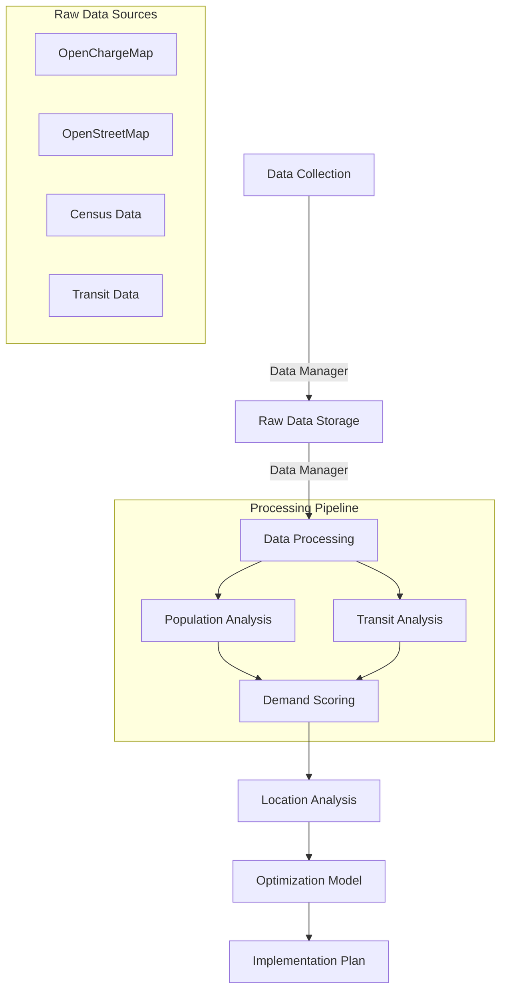

# Region of Waterloo EV Charging Station Optimization

A mixed-integer programming optimization model for strategically placing electric vehicle charging stations across the Region of Waterloo (the Kitchener-Waterloo-Cambridge Census Metropolitan Area), using real-world data and advanced spatial analysis techniques.

## Table of Contents
- [Region of Waterloo EV Charging Station Optimization](#region-of-waterloo-ev-charging-station-optimization)
  - [Table of Contents](#table-of-contents)
  - [1. Project Overview](#1-project-overview)
  - [1.1. Core Features](#11-core-features)
    - [1.2. Development Journey](#12-development-journey)
  - [2. Technical Architecture](#2-technical-architecture)
    - [2.1. Directory Structure](#21-directory-structure)
    - [2.2. Data Flow](#22-data-flow)
    - [2.1. Directory Structure](#21-directory-structure-1)
    - [2.2. Data Flow](#22-data-flow-1)
    - [2.3. Core Components](#23-core-components)
  - [3. Project Steps](#3-project-steps)
    - [3.1. Data Collection and Processing](#31-data-collection-and-processing)
    - [3.2. Location Analysis](#32-location-analysis)
    - [3.3. Optimization Model](#33-optimization-model)
    - [3.4. Validation and Testing](#34-validation-and-testing)
  - [4. Getting Started](#4-getting-started)
    - [4.1. Prerequisites](#41-prerequisites)
    - [4.2. Installation](#42-installation)
    - [4.3. Environment Setup](#43-environment-setup)
    - [4.4. Workflow Guide](#44-workflow-guide)
  - [5. Results and Analysis](#5-results-and-analysis)
  - [6. Contributing](#6-contributing)
  - [7. License](#7-license)

## 1. Project Overview

This project develops a comprehensive optimization model for strategically placing electric vehicle charging stations across the Kitchener-Waterloo region. Using real-world data from multiple authoritative sources and advanced optimization techniques, we aim to maximize accessibility while considering various practical constraints and objectives.

The model integrates:
- Population demographics from Statistics Canada Census 2021
- Existing charging infrastructure from OpenChargeMap
- Transportation networks from Region of Waterloo
- Land use patterns from OpenStreetMap
- Real-time transit data and accessibility metrics

## 1.1. Core Features

1. **Comprehensive Data Integration**
   - Census tract population and demographics
   - Existing charging station locations and types
   - Public transit routes and stops
   - Land use and zoning data
   - Real-time transit accessibility metrics
   - Population density and distribution patterns

2. **Advanced Analysis**
   - Population density clustering
   - Transit accessibility scoring
   - Demographics-based demand modeling
   - Coverage gap identification
   - Multi-factor location scoring

3. **Optimization Framework**
   - Mixed Integer Linear Programming (MILP) model
   - Multi-objective optimization considering:
     - Population coverage maximization
     - Cost minimization
     - Equitable access requirements
     - Infrastructure constraints
   - Implementation phase planning
   - Sensitivity analysis capabilities

4. **Visualization and Reporting**
   - Interactive coverage maps
   - Population density heatmaps
   - Transit accessibility visualization
   - Demographic analysis charts
   - Implementation recommendations

### 1.2. Development Journey

Our approach follows a systematic, data-driven methodology:

1. **Data Collection and Integration**
   - Comprehensive data collection from multiple sources
   - Data validation and cleaning
   - Integration of diverse datasets
   - Quality assurance checks

2. **Demand Analysis**
   - Population density analysis
   - Transit accessibility scoring
   - Demographic pattern identification
   - Coverage gap assessment

3. **Location Analysis**
   - Existing infrastructure assessment
   - Potential site identification
   - Multi-factor location scoring
   - Coverage optimization planning

4. **Optimization and Recommendations**
   - Model development and validation
   - Scenario analysis
   - Implementation planning
   - Results verification

## 2. Technical Architecture

### 2.1. Directory Structure

```plaintext
kw-ev-charging-optimization/
├── data/
│   ├── raw/
│   │   ├── charging_stations/         # OpenChargeMap data
│   │   ├── potential_locations/       # OSM extracted locations
│   │   ├── population/                # Census tract data
│   │   └── transportation/            # Transit network data
|   |
│   └── processed/
│       ├── analyzed_data/             # Processed analytical results
│       └── integrated_data/           # Combined datasets
|
├── notebooks/
│   ├── 01_data_collection.ipynb      # Data collection and validation
│   ├── 02_demand_analysis.ipynb      # Population and demand analysis
│   ├── 03_location_analysis.ipynb    # Site scoring and selection
│   └── 04_optimization_model.ipynb   # MILP optimization model
|
├── src/
│   ├── data/
│   │   ├── constants.py              # Project constants
│   │   ├── data_manager.py           # Data processing utilities
│   │   ├── endpoints.py              # API endpoints
│   │   └── utils.py                  # Helper functions
|   |
│   ├── models/
│   │   └── facility_location.py      # Optimization model
|   |
│   └── visualization/
│       └── map_viz.py               # Mapping functions
|
├── verify_setup.py
├── requirements.txt
└── README.md
```

### 2.2. Data Flow

`## 2. Technical Architecture

### 2.1. Directory Structure

```plaintext
kw-ev-charging-optimization/
├── data/
│   ├── raw/
│   │   ├── charging_stations/
│   │   ├── potential_locations/
│   │   ├── population/
│   │   └── transportation/
|   |
│   └── processed/
│       ├── demand_points/
│       └── integrated_analyzed_data/
|
├── notebooks/
│   ├── 01_data_collection.ipynb
│   ├── 02_demand_analysis.ipynb
│   ├── 03_location_analysis.ipynb
│   └── 04_optimization_model.ipynb
|
├── src/
│   ├── data/
│   │   ├── constants.py
│   │   ├── data_manager.py
│   │   ├── endpoints.py
│   │   └── utils.py
|   |
│   ├── models/
│   │   └── facility_location.py
|   |
│   ├── visualization/
│   |   └── map_viz.py
|   |
│   └── verify_setup.py
|
├── requirements.txt
├── setup.py
└── README.md
```

### 2.2. Data Flow




### 2.3. Core Components

1. **Data Management Layer**
   - **DataManager (`data_manager.py`)**
     - Unified data processing interface
     - OpenChargeMap data fetching
     - OpenStreetMap data processing
     - Population data analysis
     - Transit accessibility calculations
     - Geographic operations
     - Coverage analysis
     - Data validation and cleaning

   - **Constants (`constants.py`)**
     - Geographic boundaries
     - KW region boundaries
     - Data paths and file structures
     - System parameters
     - Location type mappings
     - Icon configurations

   - **Utils (`utils.py`)**
     - File handling utilities
     - Data processing helpers
     - Timestamp management
     - Data validation
     - Input/output operations

2. **Analysis Components**
   - **Population Analysis**
     - Density calculations
     - Demographic clustering
     - Coverage metrics
     - Demand scoring

   - **Transit Analysis**
     - Accessibility scoring
     - Service area calculation
     - Coverage gap identification
     - Multi-modal analysis

3. **Visualization Tools**
   - **MapViz (`map_viz.py`)**
     - Interactive mapping
     - Population heatmaps
     - Transit coverage
     - Location recommendations
     - Custom color schemes
     - Layer management

   - **PlotUtils (`plot_utils.py`)**
     - Statistical visualizations
     - Demographic charts
     - Coverage analysis plots
     - Score distributions

4. **Package Configuration**
   - **Setup (`setup.py`)**
     - Package dependencies
     - Version management
     - Installation configuration
     - Development requirements

5. **Optimization Framework**
   - **FacilityLocation (`facility_location.py`)**
     - MILP model implementation
     - Multi-objective optimization
     - Constraint handling
     - Solution generation

## 3. Project Steps

### 3.1. Data Collection and Processing
- [x] Project setup and environment configuration
- [x] API client development
  - OpenChargeMap integration
  - OpenStreetMap data extraction
  - Census data processing
- [x] Data validation framework
  - Input validation
  - Schema checking
  - Geographic bounds validation
- [x] Initial data collection
  - Charging station data
  - Potential location identification
  - Population distribution data

### 3.2. Location Analysis
- [x] Population density analysis
  - Census data integration
  - Density calculations
  - Geographic clustering
- [x] Coverage calculations
  - Service area definition
  - Population coverage metrics
  - Accessibility scoring
- [x] Location scoring
  - Multi-factor scoring system
  - Weight optimization
  - Validation metrics

### 3.3. Optimization Model
- [x] Model formulation
  - Objective function definition
  - Constraint development
  - Variable specification
- [x] Solution implementation
  - Gurobi model creation
  - Solver configuration
  - Solution extraction
- [x] Results analysis
  - Coverage assessment
  - Cost analysis
  - Implementation planning

### 3.4. Validation and Testing
- [ ] Model validation
  - Parameter testing
  - Constraint verification
  - Solution quality assessment
- [ ] Sensitivity analysis
  - Parameter sensitivity
  - Constraint impacts
  - Solution stability
- [ ] Implementation feasibility
  - Cost assessment
  - Phasing strategy
  - Risk analysis

## 4. Getting Started

### 4.1. Prerequisites
- Python 3.12 or higher
- Gurobi Optimizer License
- OpenChargeMap API key
- Git
- Virtual environment management tool

### 4.2. Installation

1. Clone the Repository
```bash
git clone https://github.com/jaxendutta/kw-ev-charging-optimization.git
cd kw-ev-charging-optimization
```

2. Create Virtual Environment
```bash
python -m venv venv
source venv/bin/activate  # On Windows: venv\Scripts\activate
```

3. Install Project Package
```bash
# Install in editable mode with development dependencies
pip install -e .
```

4. Configure Environment Variables
```bash
cp .env.example .env
# Edit .env with your API keys and configuration
```

### 4.3. Environment Setup

1. Install Required Python Packages
   ```bash
   # Install core requirements
   pip install -r requirements.txt
   ```

1. Configure API Access
   - Obtain OpenChargeMap API key [here](https://openchargemap.org/site/developerinfo)
   - Set up environment variables in `.env` file:
     ```
     OCMAP_API_KEY=your_api_key_here
     ```

1. Verify Setup
   ```bash
   python src/verify_setup.py
   ```

### 4.4. Workflow Guide

1. Data Collection and Exploration
   ```bash
   jupyter notebook notebooks/01_data_collection_and_exploration.ipynb
   ```
   - Collects current charging station data
   - Identifies potential locations
   - Performs initial data analysis

2. Location Analysis
   ```bash
   jupyter notebook notebooks/02_location_analysis.ipynb
   ```
   - Analyzes population distribution
   - Calculates coverage metrics
   - Scores potential locations

3. Optimization Model
   ```bash
   jupyter notebook notebooks/03_optimization_model.ipynb
   ```
   - Implements optimization model
   - Generates solution
   - Analyzes results

## 5. Results and Analysis

The project provides comprehensive results including:

1. **Coverage Analysis**
   - Population coverage maps
   - Service area calculations
   - Accessibility metrics

2. **Implementation Plan**
   - Phased deployment strategy
   - Cost breakdown
   - Timeline recommendations

3. **Performance Metrics**
   - Coverage statistics
   - Cost-benefit analysis
   - Optimization objectives achievement

## 6. Contributing

Please see [CONTRIBUTING.md](CONTRIBUTING.md) for detailed contribution guidelines.

## 7. License

This project is licensed under the MIT License - see the [LICENSE](LICENSE) file for details.
