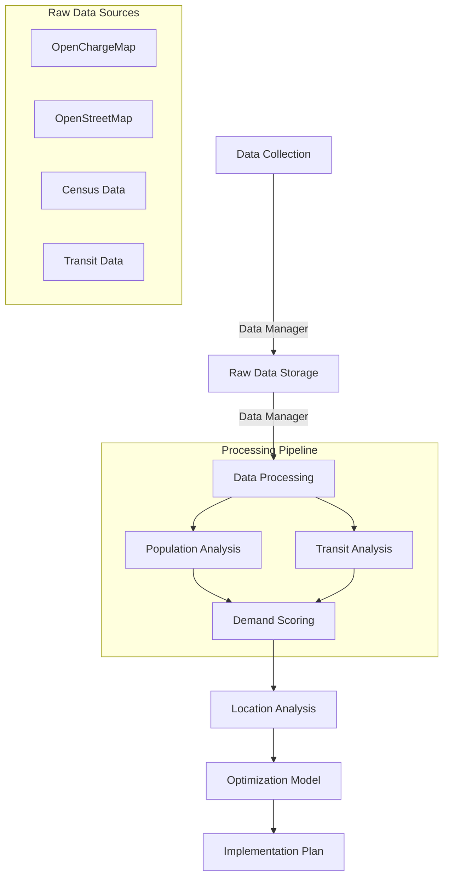

## 1. Project Foundation
### 1.1. Geographic Scope
- **Cities**: Kitchener, Waterloo, Cambridge
- **Townships**: Woolwich, Wilmot, North Dumfries, Wellesley
- **Total Area**: [Area from your integrated data] km²
- **Population**: 715,219 (Census 2021)

### 1.2. Core Objectives
#### 1.2.1. Coverage Maximization
- Population density weighted coverage
- EV ownership density alignment
- Multi-level service areas (500m walking, 2km driving)
- Transit accessibility integration

#### 1.2.2. Infrastructure Optimization
- Strategic L2 to L3 conversions
- New station placement optimization
- Port count optimization
- Grid capacity constraints

#### 1.2.3. Cost Efficiency
- Budget-aware planning
- Infrastructure reuse optimization
- Phased implementation strategy
- ROI-driven decision making

#### 1.2.4. Network Resilience
- Grid capacity consideration
- Future growth accommodation
- Redundancy planning
- Service level guarantees

## 2. Data Collection and Processing
### 2.1. Geographic & Infrastructure Data
#### 2.1.1. Boundary Data
- **Source**: Region of Waterloo Open Data [^1]
- **Content**: KWC-CMA boundary, Census tract boundaries
- **Processing**: 
  - Validation of geometric integrity
  - Projection to UTM Zone 17N for accurate measurements
  - Area calculations and spatial indexing

#### 2.1.2. Existing Charging Infrastructure
- **Source**: OpenChargeMap API [^2]
- **Content**: 
  - 39 existing charging stations
  - 19 in Waterloo, 20 in Kitchener
  - Detailed port configurations and operator information
- **Processing**:
  - Geocoding validation
  - Classification by charger type (Level 2/3)
  - Power capacity analysis
  - Operating hours and accessibility assessment

#### 2.1.3. Potential Locations
- **Source**: OpenStreetMap via OSMnx [^3]
- **Content**:
  - Commercial centers
  - Parking facilities
  - Retail locations
  - Public facilities
- **Processing**:
  - Land use compatibility analysis
  - Grid proximity assessment
  - Accessibility scoring
  - Site suitability ranking

[^1]: Region of Waterloo Open Data (https://rowopendata-rmw.opendata.arcgis.com/)
[^2]: OpenChargeMap API (https://api.openchargemap.io/)
[^3]: OpenStreetMap via OSMnx (https://osmnx.readthedocs.io/)

### 2.2. Population and Demographics
#### 2.2.1. Census Data (2021)
- **Source**: Statistics Canada Census Tracts [^4]
- **Content**: 
 - Population: 715,219 total residents
 - Households: 275,940 dwellings 
 - Average household size: 2.6
- **Processing**:
 - Census tract level aggregation
 - Population density calculations
 - Demographic weightings for coverage metrics

#### 2.2.2. Housing Characteristics
- **Content**:
 - Building age distribution
 - Dwelling types (single/multi-unit)
 - Ownership vs rental patterns
 - Property values
- **Processing**:
 - Infrastructure age correlation analysis
 - Grid capacity proxy metrics
 - Multi-unit charging demand estimation

### 2.3. EV Adoption Patterns
#### 2.3.1. Forward Sortation Area (FSA) Data
- **Source**: Ontario EV Database [^5]
- **Coverage**: All FSA codes in KWC-CMA region:
 - Waterloo: N2J, N2K, N2L, N2T, N2V, N2M
 - Kitchener: N2A through N2H, N2M through N2R
 - Cambridge: N1P through N1T, N3C, N3E, N3H
 - Townships: N0B, N3A, N3B
- **Processing**:
 - EV density calculations per FSA
 - BEV vs PHEV ratio analysis
 - Adoption trend projections
 - Spatial distribution mapping

#### 2.3.2. Vehicle Type Analysis
- **Content**:
 - Battery Electric Vehicles (BEV)
 - Plug-in Hybrid Electric Vehicles (PHEV)
 - Total EV counts per area
- **Metrics**:
 - Average EV density
 - BEV/PHEV ratios
 - Growth rates
 - Spatial clustering

### 2.4. Transportation Network
#### 2.4.1. Transit Infrastructure
- **Source**: Grand River Transit (GRT) Open Data [^6]
- **Content**:
 - Bus routes and stops
 - ION light rail stations
 - Service frequencies
 - Coverage areas
- **Processing**:
 - Route density analysis
 - Stop accessibility scoring
 - Multi-modal integration assessment
 - Transit coverage calculations

[^4]: Statistics Canada, Census 2021 (https://www12.statcan.gc.ca/census-recensement/2021/)
[^5]: Electric Vehicles in Ontario by Forward Sortation Area (https://data.ontario.ca/dataset/electric-vehicles-in-ontario-by-forward-sortation-area)
[^6]: GRT Open Data (https://www.grt.ca/en/about-grt/open-data.aspx)

### 2.5. Data Integration Process
#### 2.5.1. Population-Based Demand Points
- **Creation Process**:
 - Census tract centroids as base points
 - Population weighting factors
 - Density-based clustering analysis
 - Service area calculations
- **Scoring Components**:
 - Base population density (40%)
 - Infrastructure quality (25%)
 - Transit accessibility (20%)
 - Housing characteristics (15%)

#### 2.5.2. EV Ownership Integration
- **Methodology**:
 - FSA-level data downscaling to census tracts
 - BEV/PHEV ratio consideration
 - Current adoption rate weighting
 - Growth trend projection

#### 2.5.3. Infrastructure Assessment
- **Existing Network Analysis**:
 - Current Coverage:
   - Level 2: 39.4% of population within 500m
   - Level 3: 28.7% of population within 5km
 - Station Distribution:
   - 39 total stations
   - Average distance between stations: 2.3km
   - L3 coverage gaps identified in high-density areas

### 2.6. Potential Site Selection
#### 2.6.1. Site Categories
- **Commercial Centers**:
 - Shopping malls
 - Retail complexes
 - Business parks
- **Transportation Hubs**:
 - Major parking facilities
 - Transit stations
 - Park & ride locations
- **Public Facilities**:
 - Community centers
 - Libraries
 - Recreation centers
- **Other Strategic Locations**:
 - Fuel stations
 - Highway corridors
 - Dense residential areas

#### 2.6.2. Site Scoring Methodology
- **Base Score Components**:
 - Population proximity (35%)
 - EV ownership density (25%)
 - Grid infrastructure (20%)
 - Transit accessibility (15%)
 - Future growth potential (5%)

- **Adjustment Factors**:
 - Existing charging proximity
 - Land use compatibility
 - Property ownership
 - Grid capacity constraints

#### 2.6.3. Data Processing Pipeline
1. **Raw Data Collection**:
  - API integrations
  - Database queries
  - GIS data processing
  
2. **Data Cleaning**:
  - Coordinate validation
  - Missing value handling
  - Duplicate removal
  - Format standardization

3. **Spatial Processing**:
  - Projection standardization (UTM Zone 17N)
  - Boundary clipping
  - Buffer analysis
  - Intersection calculations

4. **Score Calculation**:
  - Component normalization
  - Weight application
  - Composite score generation
  - Ranking and prioritization

```markdown
## 3. Technical Implementation
### 3.1. Optimization Model Structure
#### 3.1.1. Decision Variables
- **Station Placement**:
  ```python
  # Binary variables for station decisions
  new_l2_station[i] ∈ {0,1}  # New Level 2 station at site i
  new_l3_station[i] ∈ {0,1}  # New Level 3 station at site i
  upgrade[i] ∈ {0,1}         # Upgrade L2 to L3 at site i
  ```

- **Port Allocation**:
  ```python
  # Integer variables for port counts
  new_l2_ports[i] ∈ ℤ⁺      # Number of L2 ports to add at site i
  new_l3_ports[i] ∈ ℤ⁺      # Number of L3 ports to add at site i
  ```

- **Coverage Tracking**:
  ```python
  # Binary variables for population coverage
  coverage_l2[j] ∈ {0,1}    # Demand point j covered by L2
  coverage_l3[j] ∈ {0,1}    # Demand point j covered by L3
  ```

#### 3.1.2. Objective Function
```python
Maximize:
    # Coverage Benefits (weighted by population and EV density)
    weights['l3_coverage'] * Σ(coverage_l3[j] * demand_points[j].weight) +
    weights['l2_coverage'] * Σ(coverage_l2[j] * demand_points[j].weight) -
    
    # Cost Components
    weights['cost'] * (
        # New Infrastructure Costs
        Σ(new_l2_station[i] * costs['l2_station']) +
        Σ(new_l2_ports[i] * costs['l2_port']) +
        Σ(new_l3_station[i] * costs['l3_station']) +
        Σ(upgrade[i] * costs['l3_station']) +
        Σ(new_l3_ports[i] * costs['l3_port']) -
        
        # Resale Revenue from Upgrades
        Σ(upgrade[i] * (
            costs['l2_station'] * costs['resale_factor'] +
            current_ports[i] * costs['l2_port'] * costs['resale_factor']
        ))
    )
```

#### 3.1.3. Key Constraints
1. **Budget Constraints**:
   ```python
   # Total cost must be within budget
   total_cost - resale_revenue <= budget_limit
   ```

2. **Coverage Requirements**:
   ```python
   # Minimum population coverage requirements
   Σ(coverage_l2[j] * demand_points[j].weight) >= min_coverage_l2
   Σ(coverage_l3[j] * demand_points[j].weight) >= min_coverage_l3
   ```

3. **Grid Capacity**:
   ```python
   # Power demand at each site
   l2_power[i] + l3_power[i] <= grid_capacity[i]
   ```

4. **Logical Constraints**:
   ```python
   # Cannot have both L2 and L3 at same site
   new_l2_station[i] + new_l3_station[i] + upgrade[i] <= 1
   
   # Minimum ports per station
   new_l2_ports[i] >= new_l2_station[i]
   new_l3_ports[i] >= (new_l3_station[i] + upgrade[i]) * min_l3_ports
   ```

### 3.2. Solution Approach
#### 3.2.1. Optimization Framework
- **Solver**: Gurobi Optimizer
- **Model Type**: Mixed-Integer Linear Programming (MILP)
- **Solution Method**: Branch and Bound with cutting planes

```markdown
#### 3.2.2. Implementation Steps
1. **Model Initialization**
   - Load processed data structures
   - Set up Gurobi environment
   - Initialize variable containers
   - Configure solver parameters:
     ```python
     model.setParam('OutputFlag', 0)      # Suppress Gurobi output
     model.Params.DualReductions = 0      # Avoid infeasibility issues
     model.Params.PreDual = 0            # Preprocessing settings
     model.Params.Method = 2             # Use barrier method
     model.Params.BarHomogeneous = 1     # Enhanced homogeneous algorithm
     ```

2. **Variable Creation**
   - Decision variables for n_sites potential locations
   - Coverage variables for n_points demand points
   - Cost tracking variables for budget constraints
   - Port allocation variables with bounds:
     ```python
     new_l2_ports = model.addVars(
         n_sites, vtype=GRB.INTEGER,
         lb=0, ub=max_new_ports,
         name="new_l2_ports"
     )
     ```

3. **Constraint Generation**
   - Budget constraints including resale revenue
   - Coverage requirements from initial and new stations
   - Grid capacity limits at each location
   - Logical constraints for station types
   - Port allocation rules:
     ```python
     # Minimum ports for L3 stations
     model.addConstr(
         new_l3_ports[i] >= 
         (new_l3_station[i] + upgrade[i]) * 
         min_ports_per_l3
     )
     ```

### 3.3. Solution Analysis
#### 3.3.1. Coverage Metrics
- **Population Coverage**
  - Initial vs. Final coverage comparison
  - Service area analysis by charger type
  - Access equity assessment
  - Transit integration impact

- **EV Owner Access**
  - Coverage by vehicle type (BEV/PHEV)
  - Distance to nearest charger analysis
  - Service level guarantees
  - Future growth accommodation

#### 3.3.2. Infrastructure Changes
- **Station Modifications**
  ```python
  {
      'new_l2_stations': {
          'count': new_l2_stations,
          'cost': new_l2_stations * costs['l2_station']
      },
      'l2_ports': {
          'count': new_l2_ports,
          'cost': new_l2_ports * costs['l2_port']
      },
      'upgrades': {
          'count': upgrades,
          'cost': upgrades * costs['l3_station']
      }
  }
  ```

- **Financial Impact**
  - Installation costs
  - Revenue potential
  - Operating expenses
  - ROI calculations
```

```markdown
### 3.4. Sensitivity Analysis
#### 3.4.1. Parameter Sensitivity
- **Budget Variations**
  - Base case: $4,000,000
  - Range tested: $2M to $6M
  - Impact on:
    - Coverage levels
    - Infrastructure choices
    - Implementation phasing
    - ROI metrics

- **Coverage Requirements**
  - L2 coverage: 85-95%
  - L3 coverage: 75-90%
  - Service radius variations:
    - L2: 0.4km to 0.8km
    - L3: 3km to 7km

#### 3.4.2. Constraint Analysis
```python
sensitivity_results = {
    'constraints': {
        'Budget': {
            'slack': float(slack),
            'rhs': float(rhs),
            'utilization': float((rhs - slack) / rhs * 100)
        },
        'L2 Coverage': {...},
        'L3 Coverage': {...}
    },
    'insights': [
        "Budget constraint is binding - additional funding could improve solution",
        "L3 coverage requirement achieved with margin",
        ...
    ]
}
```

### 3.5. Implementation Planning
#### 3.5.1. Phased Approach
1. **Phase 1: L2 to L3 Upgrades**
   - Timeframe: Months 1-4
   - Focus:
     - Convert strategic L2 stations to L3
     - Upgrade electrical infrastructure
     - Install new L3 ports
   - Metrics:
     ```python
     {
         'actions': upgrade_count + new_port_count,
         'stations': upgrade_count,
         'ports': new_l3_ports,
         'cost': upgrade_costs
     }
     ```

2. **Phase 2: New L3 Stations**
   - Timeframe: Months 5-8
   - Focus:
     - Install new L3 stations
     - Grid connection work
     - Site preparation
   - Implementation:
     ```python
     {
         'actions': new_l3_stations * (1 + ports_per_station),
         'stations': new_l3_station_count,
         'ports': new_l3_port_count,
         'cost': installation_costs
     }
     ```
```

```markdown
3. **Phase 3: L2 Network Expansion**
   - Timeframe: Months 9-12
   - Focus:
     - Install new L2 stations
     - Complete coverage gaps
     - Network optimization
   - Deliverables:
     ```python
     {
         'actions': new_l2_stations * (1 + ports_per_station),
         'stations': new_l2_station_count,
         'ports': new_l2_port_count,
         'cost': l2_installation_costs
     }
     ```

#### 3.5.2. Site-Specific Planning
1. **L3 Upgrade Sites**
   ```python
   {
       'id': f'upgrade_{idx}',
       'location': {
           'latitude': site.latitude,
           'longitude': site.longitude,
           'type': site.location_type
       },
       'implementation': {
           'grid_requirements': {
               'power_increase': power_delta,
               'voltage_requirement': '480V'
           },
           'estimated_cost': upgrade_cost
       }
   }
   ```

2. **New Station Locations**
   ```python
   {
       'id': f'new_L3_{idx}',
       'location': {...},
       'charging': {
           'charger_type': 'Level 3',
           'num_ports': ports,
           'power_output': {
               'kw': 350,
               'voltage': 480
           }
       }
   }
   ```

### 3.6. Visualization Pipeline
#### 3.6.1. Interactive Maps
1. **Coverage Analysis**
   - Population density heatmap
   - Service area overlays
   - Station status indicators
   - Implementation phases
   ```python
   m = create_kwc_map("Enhanced Charging Network Plan")
   m = plot_population_density(m, population_data)
   m = plot_charging_stations(m, stations_df)
   m = plot_coverage_areas(m, service_areas)
   ```

2. **Network Enhancement**
   - Upgrade candidates
   - New station locations
   - Grid capacity zones
   - Transit integration points
   ```python
   folium.CircleMarker(
       location=[loc['latitude'], loc['longitude']],
       radius=8,
       color=status_colors[status],
       popup=station_popup(station)
   ).add_to(m)
   ```
```

```markdown
#### 3.6.2. Analytics Dashboards
1. **Coverage Metrics**
   ```python
   # Create comprehensive visualization of optimization results
   def plot_optimization_results(solution: Dict[str, Any]) -> plt.Figure:
       fig, ((ax1, ax2), (ax3, ax4)) = plt.subplots(2, 2, figsize=(20, 16))
       
       # 1. Infrastructure Changes
       station_counts = {
           'Initial L2': initial_l2_count,
           'Initial L3': initial_l3_count,
           'Upgrades': len(solution['upgrades']),
           'New L2': len(solution['new_stations']['l2']),
           'New L3': len(solution['new_stations']['l3'])
       }
       ax1.bar(station_counts.keys(), station_counts.values())
       
       # 2. Cost Analysis
       # 3. Coverage Improvement
       # 4. Implementation Timeline
   ```

#### 3.6.3. Performance Metrics
1. **Coverage Analysis**
   ```python
   coverage_metrics = {
       'initial': {
           'l2_coverage': initial_l2,
           'l3_coverage': initial_l3
       },
       'final': {
           'l2_coverage': final_l2,
           'l3_coverage': final_l3
       },
       'improvement': {
           'l2': final_l2 - initial_l2,
           'l3': final_l3 - initial_l3
       }
   }
   ```

2. **Cost Efficiency**
   ```python
   cost_analysis = {
       'total_purchase': sum(item['cost'] for item in costs['new_infrastructure'].values()),
       'total_revenue': sum(item['revenue'] for item in costs['resale_revenue'].values()),
       'net_cost': total_purchase - total_revenue,
       'cost_per_coverage_point': net_cost / (coverage_improvement_l2 + coverage_improvement_l3)
   }
   ```

### 3.7. Results Validation
#### 3.7.1. Model Validation
1. **Constraint Satisfaction**
   - Budget compliance
   - Coverage requirements
   - Grid capacity limits
   - Logical consistency

2. **Solution Quality**
   - Optimality gap
   - Sensitivity robustness
   - Constraint utilization
   ```python
   validation_metrics = {
       'optimality_gap': model.MIPGap,
       'constraint_satisfaction': all_constraints_met,
       'solution_feasibility': model.Status == GRB.OPTIMAL
   }
   ```
```

```markdown
#### 3.7.2. Solution Quality Metrics
1. **Optimization Performance**
   ```python
   quality_metrics = {
       'solver_metrics': {
           'solution_count': model.SolCount,
           'node_count': model.NodeCount,
           'runtime': model.Runtime,
           'gap': model.MIPGap
       },
       'constraint_utilization': {
           'budget': budget_used / budget_limit,
           'l2_coverage': achieved_l2 / required_l2,
           'l3_coverage': achieved_l3 / required_l3
       }
   }
   ```

2. **Coverage Validation**
   ```python
   coverage_validation = {
       'population_covered': {
           'l2': {
               'initial': initial_l2_coverage,
               'final': final_l2_coverage,
               'improvement': coverage_delta_l2
           },
           'l3': {
               'initial': initial_l3_coverage,
               'final': final_l3_coverage,
               'improvement': coverage_delta_l3
           }
       },
       'service_gaps': identified_gaps,
       'redundancy_analysis': overlap_metrics
   }
   ```

### 3.8. Implementation Framework
#### 3.8.1. Grid Infrastructure Requirements
1. **Power Capacity Analysis**
   ```python
   grid_requirements = {
       'l2_stations': {
           'voltage': 240,
           'power_per_port': 19.2,  # kW
           'total_requirement': l2_ports * 19.2
       },
       'l3_stations': {
           'voltage': 480,
           'power_per_port': 350,  # kW
           'total_requirement': l3_ports * 350
       }
   }
   ```

2. **Site Preparation Requirements**
   ```python
   site_requirements = {
       'electrical': {
           'transformer_upgrades': transformer_needs,
           'wiring_requirements': wiring_specs,
           'protection_systems': protection_reqs
       },
       'civil': {
           'surface_work': surface_modifications,
           'accessibility': access_requirements,
           'signage': signage_specs
       }
   }
   ```
```
```markdown
#### 3.8.2. Technical Implementation Specifications

1. **L2 to L3 Conversion Requirements**
   ```python
   upgrade_specifications = {
       'electrical': {
           'input_power': {
               'voltage': '480V three-phase',
               'current': '729A maximum',
               'power_factor': 0.95
           },
           'protection': {
               'overcurrent': 'Required per NEC 625.41',
               'ground_fault': 'Required per NEC 625.42',
               'surge': 'ANSI C62.41 Category B3'
           },
           'transformer': {
               'rating': '500 kVA minimum',
               'type': 'Pad-mounted',
               'cooling': 'KNAN/KNAF'
           }
       },
       'civil_works': {
           'pad_requirements': '6" reinforced concrete',
           'conduit_specs': 'Schedule 80 PVC',
           'spacing': 'Minimum 4ft between units'
       }
   }
   ```

2. **New Station Installation Guidelines**
   ```python
   installation_guidelines = {
       'site_preparation': {
           'surface_requirements': {
               'l2_stations': 'Reinforced concrete pad 4" depth',
               'l3_stations': 'Reinforced concrete pad 6" depth'
           },
           'drainage': 'Minimum 2% slope away from equipment',
           'lighting': 'Minimum 2 fc at charging connection'
       },
       'accessibility': {
           'parking_space': '9ft x 18ft minimum',
           'clear_space': '36in minimum path',
           'protection': 'Bollards or wheel stops required'
       }
   }
   ```

### 3.9. Performance Monitoring Framework
#### 3.9.1. Coverage Metrics Tracking
```python
monitoring_metrics = {
    'coverage': {
        'population_access': {
            'l2': {
                'target': 0.95,  # 95% coverage
                'radius': 500,   # meters
                'measurement': 'monthly'
            },
            'l3': {
                'target': 0.85,  # 85% coverage
                'radius': 5000,  # meters
                'measurement': 'monthly'
            }
        },
        'ev_owner_access': {
            'target': 0.98,     # 98% of EV owners covered
            'measurement': 'quarterly'
        }
    }
}
```

## 1. Project Overview

This project develops a comprehensive optimization model for enhancing the region's EV charging infrastructure through four key strategies:

1. Strategic L2 to L3 Conversion
   - Identification of high-impact L2 stations for L3 upgrades
   - Grid capacity consideration for upgrades
   - Cost-benefit analysis of conversions
   - Phased implementation planning

2. Network Coverage Enhancement
   - Population coverage maximization
   - EV ownership density alignment
   - Transit accessibility integration
   - Service area optimization

3. Infrastructure Optimization
   - Removal of underutilized stations
   - Strategic new station placement
   - Port count optimization at existing locations
   - Grid capacity-aware planning

4. Comprehensive Network Planning
   - Demand-driven location selection
   - Multi-objective optimization
   - Cost-effective implementation
   - Future growth consideration

The model integrates:
- Real EV ownership patterns from Ontario's FSA-level data
- Existing charging infrastructure from OpenChargeMap
- Population demographics from Statistics Canada Census 2021
- Transit network data from Grand River Transit
- Land use and accessibility metrics
- Grid capacity constraints

## 2. Optimization Strategy

Our optimization approach focuses on:

1. **L2 to L3 Conversion**
   - **Decision Variables:**
     - Binary variables for upgrade decisions
     - Port addition variables
     - Grid capacity allocation
   - **Constraints:**
     - Maximum power capacity per area
     - Minimum distance between L3 chargers
     - Budget limitations
     - Implementation timing

2. **Coverage Maximization**
   - **Objectives:**
     - Population coverage within 5km of L3
     - EV density-weighted coverage
     - Transit accessibility integration
   - **Constraints:**
     - Minimum coverage requirements
     - Maximum service overlap
     - Equity considerations

3. **Station Optimization**
   - **Removal Criteria:**
     - Usage patterns
     - Coverage redundancy
     - Operating costs
     - Alternative availability
   - **New Placement:**
     - Demand-driven locations
     - Grid capacity availability
     - Cost-effectiveness
     - Future growth potential

4. **Port Addition Strategy**
   - **Decision Factors:**
     - Peak usage patterns
     - Wait time data
     - Population growth
     - EV adoption trends

Key Mathematical Components:
  ```python
  # Decision Variables
  x[i,j] = Binary variable for upgrading station i to type j
  y[i] = Binary variable for adding new station at location i
  z[i] = Binary variable for removing station i
  p[i] = Integer variable for additional ports at location i

  # Objective Function
  Maximize:
      Coverage_Score         # Population and EV coverage
      - Installation_Costs   # Upgrade and new station costs
      - Operating_Costs      # Ongoing operational costs
      + Efficiency_Score     # Network efficiency metrics

  Subject to:
      - Budget constraints
      - Grid capacity at each location
      - Minimum coverage requirements
      - Maximum distance between L3 chargers
      - Demand satisfaction constraints
      - Maximum stations per area
  ```

## 3. Core Features

1. **Data Integration & Analysis**
   - EV ownership density analysis
   - Population density mapping
   - Transit accessibility scoring
   - Land use pattern analysis
   - Grid capacity assessment


1. **Network Enhancement Strategy**
   - Level 2 to Level 3 conversion optimization
   - Strategic port addition planning
   - Coverage gap identification
   - Grid capacity consideration
   - Cost-benefit analysis

1. **Optimization Framework**
  - Mixed-integer linear programming model
  - Multi-objective optimization:
    - Coverage maximization
    - Cost minimization
    - Grid capacity constraints
    - Level 3 spacing requirements
  - Implementation phasing
  - Sensitivity analysis

1. **Visualization & Analysis**
  - Interactive coverage maps
  - EV density heatmaps
  - Accessibility scoring
  - Network analysis metrics
  - Implementation recommendations

## 4. Analysis Journey

Our approach follows a systematic, data-driven methodology:

1. **Data Integration**
   - Collect and clean data
   - Validate geographic coverage
   - Process EV ownership patterns
   - Calculate baseline metrics

1. **Network Analysis**
   - Assess current coverage
   - Identify upgrade candidates
   - Calculate accessibility scores
   - Evaluate grid capacity

1. **Optimization**
   - Define objective functions
   - Set up constraints
   - Generate solutions
   - Analyze sensitivity

1. **Implementation Planning**
   - Prioritize upgrades
   - Phase implementations
   - Consider grid constraints
   - Estimate costs

## 5. Technical Architecture

### 5.1. Directory Structure

```plaintext
kw-ev-charging-optimization/
├── data/
│   ├── raw/
|   |   ├── boundaries/
│   │   ├── charging_stations/
│   │   ├── ev_fsa/
│   │   ├── population/
│   │   └── potential_locations/
|   | 
│   └── processed/
|       ├── demand_points/
|       ├── ev_fsa_analyzed/
│       ├── integrated_analyzed_data/
│       └── optimization_inputs/
|
├── notebooks/
│   ├── 01_data_collection.ipynb      # Data integration
│   ├── 02_location_analysis.ipynb    # Spatial analysis
│   ├── 03_enhancement_analysis.ipynb # Network enhancement
│   ├── 04_data_preparation.ipynb     # Model input prep
│   └── 05_optimization_model.ipynb   # MILP optimization
|
├── src/
│   ├── data/
│   │   ├── constants.py          # Project constants
│   │   ├── data_manager.py       # Data processing
│   │   └── utils.py              # Helper functions
|   |
│   ├── model/
│   │   ├── network_optimizer.py  # Optimization Model
|   |   └── parameters.py         # Optimization Constants
|   |
│   ├── visualization/
|   |   ├── map_viz.py
│   |   └── optimization_viz.py
|   |
|   ├── run_optimization.py
|   └── verify_setup.py
|
├── config/
|   ├── base.json
|   |
│   ├── scenarios/
|   |   ├── aggressive.json
│   │   ├── balanced.json
│   │   └── conservative.json
|   | 
│   └── test/
|       ├── high_budget.json
│       └── low_budget.json
|
├── setup.py      
└── requirements.txt
```

### 5.2. Data Flow



### 5.3. Project Components

1. **Data Collection & Processing (`01_data_collection.ipynb`)**
   - Integration of multiple data sources
   - Data cleaning and validation
   - Geographic data processing
   - Initial visualization

2. **Location Analysis (`02_location_analysis.ipynb`)**
   - Population distribution analysis
   - Transit accessibility scoring
   - Demographic pattern identification
   - Coverage analysis

3. **Enhancement Analysis (`03_enhancement_analysis.ipynb`)**
   - EV ownership pattern analysis
   - Charging station assessment
   - Upgrade candidate identification
   - Grid capacity evaluation

4. **Data Preparation (`04_data_preparation.ipynb`)**
   - Optimization input preparation
   - Constraint calculation
   - Parameter estimation
   - Data structuring

5. **Optimization Model (`05_optimization_model.ipynb`)**
   - MILP model implementation
   - Constraint definition
   - Solution generation
   - Sensitivity analysis

## 6. Getting Started

### 6.1. Prerequisites
- Python 3.12 or higher
- Gurobi Optimizer License
- OpenChargeMap API key
- Git
- Virtual environment management tool

### 6.2. Installation

1. Clone the Repository
  ```bash
  git clone https://github.com/jaxendutta/kw-ev-charging-optimization.git
  cd kw-ev-charging-optimization
  ```

2. Create Virtual Environment
  ```bash
  python -m venv venv

  # Linux
  source venv/bin/activate

  # On Windows: venv\Scripts\activate
  ```

3. Install Project Package
  ```bash
  # Install in editable mode with development dependencies
  pip install -e .
  ```

4. Configure Environment Variables
  ```bash
  cp .env.example .env
  # Edit .env with your API keys and configuration
  ```

### 7.3. Environment Setup

1. Install Required Python Packages
   ```bash
   # Install core requirements
   pip install -r requirements.txt
   ```

1. Configure API Access
   - Obtain OpenChargeMap API key [here](https://openchargemap.org/site/developerinfo)
   - Set up environment variables in `.env` file:
     ```
     OCMAP_API_KEY=your_api_key_here
     ```

1. Verify Setup
   ```bash
   python src/verify_setup.py
   ```

### 7.4. Workflow Guide

1. Data Collection:
  ```bash
  jupyter notebook notebooks/01_data_collection.ipynb
  ```

1. Analysis Pipeline:
  ```bash
  # Run notebooks in sequence
  jupyter notebook notebooks/02_location_analysis.ipynb
  jupyter notebook notebooks/03_enhancement_analysis.ipynb
  jupyter notebook notebooks/04_data_preparation.ipynb
  jupyter notebook notebooks/05_optimization_model.ipynb
  ```

## 8. Results and Analysis

### 8.1 Expected Outcomes

1. **Network Enhancement**
   - Optimized L3 charger distribution
   - Improved coverage efficiency
   - Reduced redundancy
   - Future-proof capacity

1. **Operational Efficiency**
   - Better resource utilization
   - Reduced operating costs
   - Improved user experience
   - Sustainable growth plan

1. **Coverage Improvement**
   - Increased population coverage
   - Better alignment with EV density
   - Enhanced accessibility
   - Equitable distribution


## 9. Contributing

Please see [CONTRIBUTING.md](CONTRIBUTING.md) for detailed contribution guidelines.

## 10. License

This project is licensed under the MIT License - see the [LICENSE](LICENSE) file for details.
